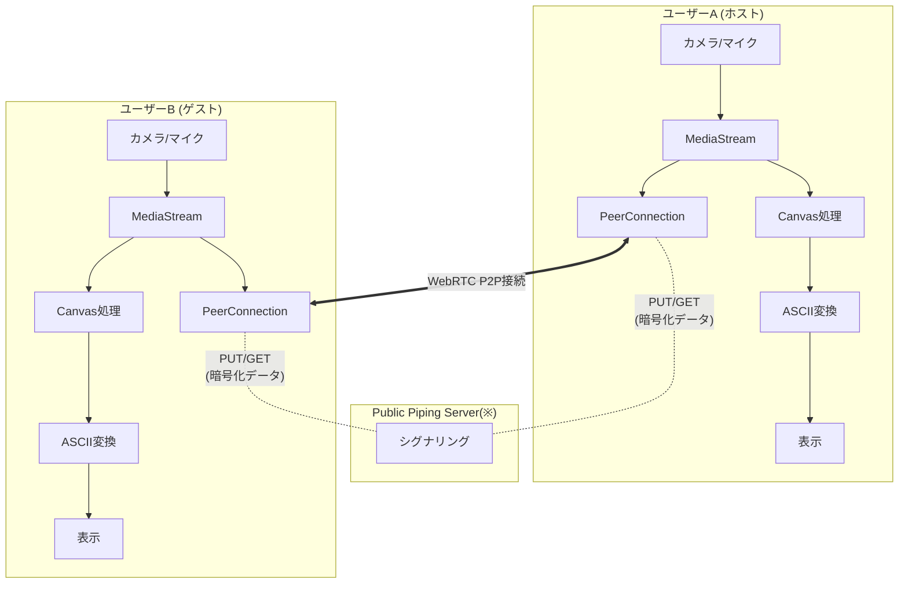
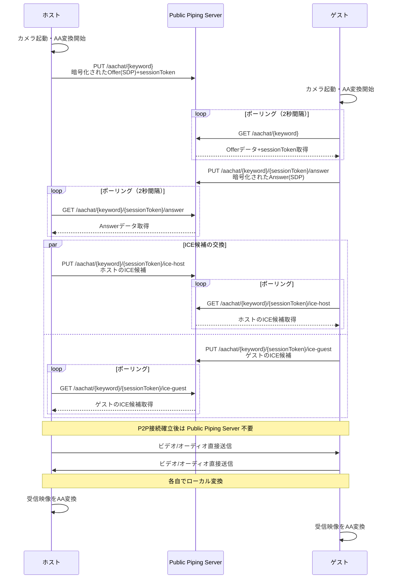

# AA電話 - WebRTCを使用したASCIIアートビデオチャット

## 概要

AA電話は、WebRTCを使用してリアルタイムでビデオをASCIIアートに変換し、相手と通信するWebアプリケーションです。通常のビデオチャットとは異なり、映像をテキスト文字で表現することで、独特な視覚体験を提供します。

## 技術構成

### 使用技術
- **WebRTC**: P2P通信
- **Piping Server**: シグナリング用途に転用
- **Canvas API**: 映像処理
- **MediaDevices API**: カメラ・マイク制御

### システム構成図



## 主要機能

### 1. WebRTC通信
- Piping Server を使用したシグナリング
- GoogleのSTUNサーバーを使用したNAT越え
- TURNサーバーは使用せず（ファイアウォール等で接続できない場合は通信不可）
- P2Pでの直接通信
- 自分でサーバー無しでWebRTC接続
- DataChannel（'aa-data'）を確立するが、実際のAAデータ送信には使用していない

### 2. ASCII アート変換
- カメラ映像を80×60文字の無駄にASCIIアートに変換
- どうせAAに変換するため、敢えての低解像度（80×60）その代わり最大60FPS
- 32段階文字セット

### 3. デバイス管理
- カメラ・マイクの選択機能
- 通話中のデバイス切り替え対応

## 通信フロー



## ASCII文字セット

32文字の明暗レベル： ( 改善の余地あり )
```
 .`'"-:;!l/tfjrxnvcXYUJ0ZMKG8#@$
```
暗い --> 明るい 

## DataChannelの設計と実装状況

### 現在のAAデータフロー
1. 自分のカメラ映像 → ローカルでAA変換 → 自分のAA表示
2. 相手のビデオストリーム → ローカルでAA変換 → 相手のAA表示
3. DataChannelはWebRTC接続確立のために必要だが、AAデータ送信には未使用

## Piping Server の活用方法

Piping Serverは本来、一回ですが、以下の方法でWebRTCシグナリングに転用しています：

1. **エンドポイント設計**: 
   - 初回のOffer: `/aachat/{keyword}`
   - 以降の通信: `/aachat/{keyword}/{sessionToken}/*`
2. **sessionToken**: 16文字のランダム文字列でセッションを分離
3. **HTTP PUT/GET**: データの保存と取得
4. **ポーリング**: リアルタイム通知がないため2秒間隔でポーリング
5. **暗号化**: キーワードをキーとしたXOR暗号化でデータを保護
6. **一時的なデータ保存**: Offer/Answer/ICE候補を一時的に保存

## セキュリティ考慮事項

- キーワードベースの簡易的なアクセス制御
- 10分間のセッション有効期限
- XOR暗号化によるSDPデータの保護（piping server経由時）

## 制限事項

- 同時接続は1対1のみ
- ブラウザのWebRTC対応が必要

## ブラウザ互換性

- Chrome/Edge（推奨）
- Firefox
- Safari（iOS含む）
